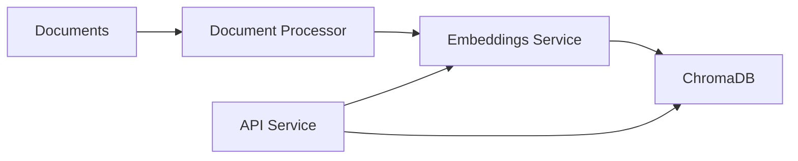

# RAG System Construction Guide

## Current Single-Container Architecture

### Components Used
1. **Document Storage and Processing**
   - Uses `SimpleDirectoryReader` from llama-index
   - Storage Location: `/app/data/documents`
   - Supports PDF, DOCX, TXT formats

2. **Vector Store**
   - ChromaDB with `EphemeralClient`
   - Collection: "document_store"
   - Storage: `/app/data/chroma_db`

3. **Embeddings**
   - `HuggingFaceEmbeddings` from LangChain
   - Model: "sentence-transformers/all-MiniLM-L6-v2"

4. **Indexing**
   - `VectorStoreIndex` from llama-index
   - Combines vector store and embeddings

5. **Service Context**
   - Configured with embedding model
   - No LLM (disabled)

6. **API Layer (FastAPI)**
   - Endpoints:
     - `/upload`: Document upload and indexing
     - `/query`: RAG queries
     - `/reload`: Index reloading
     - `/status`: System status
     - `/`: Health check

## Recommended Microservices Architecture

### Container Breakdown

1. **Vector Store Container (ChromaDB)**
```yaml
chromadb:
  image: chromadb
  volumes:
    - chroma_data:/data
  ports:
    - "8000:8000"
```
- Dedicated vector database
- Scalable storage
- Persistent data
- Replaceable with other vector stores

2. **API Service Container**
```yaml
api:
  image: rag-api
  depends_on:
    - chromadb
    - embeddings
  ports:
    - "8001:8001"
```
- FastAPI application
- Stateless design
- Request handling and routing
- Horizontally scalable

3. **Document Processor Container**
```yaml
document-processor:
  image: doc-processor
  volumes:
    - ./data/documents:/documents
  depends_on:
    - chromadb
    - embeddings
```
- Document ingestion and preprocessing
- Format parsing
- Chunking logic
- Batch processing capabilities

4. **Embeddings Service Container**
```yaml
embeddings:
  image: hf-embeddings
  deploy:
    resources:
      reservations:
        devices:
          - driver: nvidia
            count: 1
            capabilities: [gpu]
```
- Hugging Face embedding model
- GPU optimization
- Scalable computation
- Swappable models

### Benefits of Microservices Approach

1. **Independent Scaling**
   - Component-specific scaling
   - Resource optimization
   - Load-based scaling

2. **Resource Utilization**
   - GPU for embeddings
   - Memory for vector store
   - CPU for API
   - Optimized container configurations

3. **Reliability Improvements**
   - Independent component failure handling
   - Easier failover implementation
   - Issue isolation
   - Better monitoring

4. **Maintenance Advantages**
   - Independent updates
   - A/B testing capability
   - Isolated debugging
   - Component-specific monitoring

5. **Technology Flexibility**
   - Plug-and-play components
   - Easy experimentation
   - Technology updates
   - Different implementations

### Communication Flow


### When to Use Microservices
- Large-scale document processing
- Need for independent scaling
- High availability requirements
- Complex resource management
- Monitoring and observability needs
- Production deployments

### When to Keep Single Container
- Development environments
- Small deployments
- Simple use cases
- Resource constraints
- Quick prototyping

## Implementation Considerations

1. **Data Persistence**
   - Volume mapping for vector store
   - Document storage strategy
   - Backup considerations

2. **Security**
   - Inter-service communication
   - API authentication
   - Document access control
   - Network isolation

3. **Monitoring**
   - Component health checks
   - Performance metrics
   - Resource utilization
   - Error tracking

4. **Scaling Strategy**
   - Load balancing
   - Auto-scaling rules
   - Resource limits
   - Bottleneck identification

5. **Deployment**
   - Container orchestration
   - Service discovery
   - Configuration management
   - Rolling updates

## Best Practices

1. **Document Processing**
   - Implement proper chunking
   - Handle multiple formats
   - Validate inputs
   - Process asynchronously

2. **Vector Store**
   - Regular maintenance
   - Index optimization
   - Backup strategy
   - Performance monitoring

3. **API Design**
   - Clear documentation
   - Rate limiting
   - Error handling
   - Version control

4. **Resource Management**
   - Container resource limits
   - Memory management
   - CPU allocation
   - Storage planning
